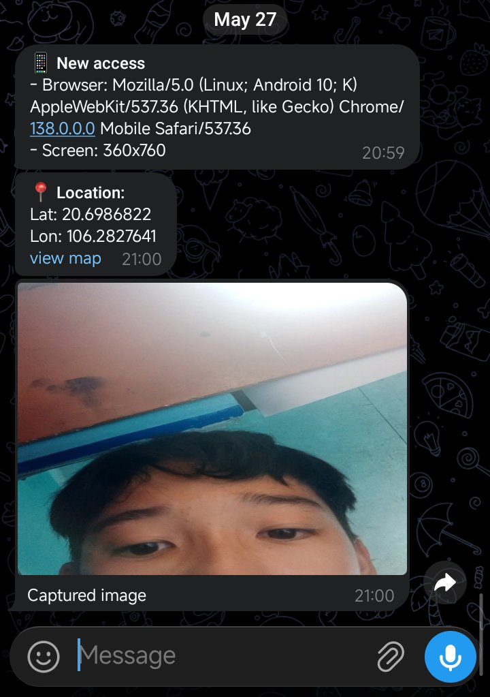

# 🌐 Social Engineering Geolocation & Camera Grabber (PoC)

> [!IMPORTANT]
> **LEGAL DISCLAIMER:** This tool is developed **STRICTLY FOR EDUCATIONAL AND SECURITY RESEARCH PURPOSES ONLY**. Utilizing this tool to gather personal data (images, locations) from individuals without their explicit, prior written consent is illegal and punishable by law. The author assumes no liability and is not responsible for any misuse, malicious activities, or damage caused by this program.

---

## 📝 Overview
This project is a **Proof of Concept (PoC)** designed to demonstrate how modern phishing and social engineering attacks abuse browser permissions and native web APIs (`Geolocation API`, `MediaDevices API`) to harvest physical identification data.

The objective of this repository is to help security researchers, pentesters, and cybersecurity students understand the mechanics of client-side data exfiltration and the deployment of a lightweight C2 (Command & Control) infrastructure utilizing the Telegram Bot API.

## ⚙️ How It Works
1. **The Bait (Social Engineering):** The victim visits a web interface designed to deceive them (e.g., a fake network speed test, fake CAPTCHA verification, or media player update).
2. **Permission Request:** The webpage triggers browser prompts requesting access to the Front Camera and Device Location.
3. **Data Harvesting & Processing:** 
   - Exact coordinates (Latitude/Longitude) are pulled using `navigator.geolocation`.
   - A snapshot from the webcam stream is captured silently using an `HTML5 Canvas` element and converted into an appropriate data format (Base64/Blob).
4. **Exfiltration:** The gathered data is immediately transmitted to a pre-configured Telegram Bot using an asynchronous HTTP POST request.
5. **Redirection:** The browser automatically redirects the victim to a legitimate website (such as Google or YouTube) to mask the malicious activity and avoid suspicion.

---

## 🚀 Setup & Deployment (Lab Environment)

To test browser permission APIs, the web application **must be served over a secure HTTPS connection**. Modern web browsers strictly block `Geolocation` and `Camera` APIs on standard HTTP connections (with the sole exception of `localhost`).

### 1. Telegram Bot Configuration
1. Message `@BotFather` on Telegram to generate a new bot and obtain your `API Token`.
2. Retrieve your personal `Chat ID` (you can use helper bots like `@userinfobot`).
3. Insert these values into the designated configuration variables within your JavaScript file.

### 2. Deploying the Test Server
To test the script across multiple devices in your local lab (e.g., a mobile phone and a PC), you need to expose your local environment via a public HTTPS URL:

* **Option 1 (Recommended for Local Labs):** Use port-forwarding/tunneling tools such as **Ngrok** or **LocalXposed** to map your localhost to a temporary, secure public URL.
```bash
  ngrok http 8080
```
Option 2: Deploy the static frontend code to cloud platforms that provision automatic SSL certificates, such as Vercel, Netlify, or GitHub Pages.
## ⚖️ Legal Compliance & Safe Practices
Authorization: Only deploy and test this script on devices that you legally own or have explicit written permission to test.
Data Retention: Destroy all harvested test data immediately after validating the functionality of your setup.
Regulatory Compliance: Ensure your activities align with local cybersecurity laws and privacy regulations (such as GDPR, CCPA, or regional cybercrime acts).
## 🛡️ Mitigation & Defense
Granular Permission Management: Never click "Allow" on location or camera prompts from untrusted, obscure, or third-party domains.
Security Extensions: Use browser extensions that restrict unauthorized JavaScript execution or block cross-site tracking.
Privacy-Focused Browsers: Utilize browsers (like Brave or Tor) that natively offer strict fingerprinting protection and tighter permission controls.
# IMG
<p align="center">
  
</p>
